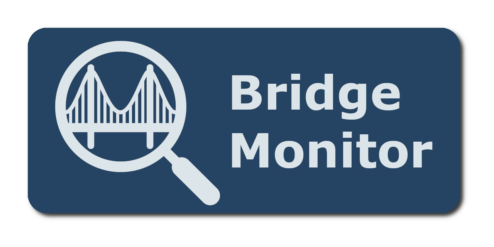
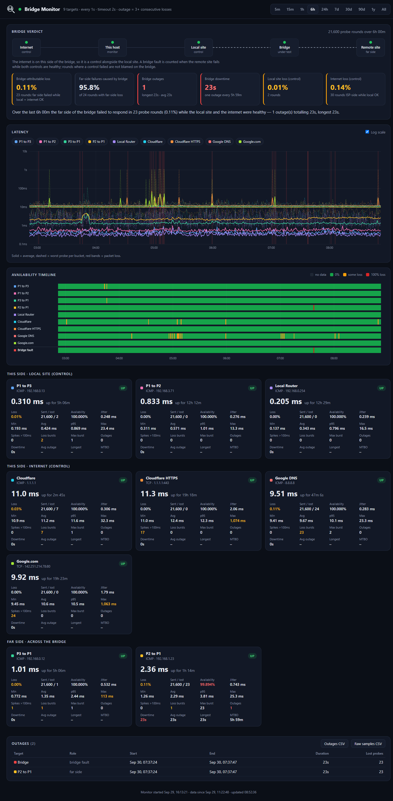

# bridge-monitor

Continuously probes a point-to-point wireless bridge (local site, remote site) plus internet
control targets, stores every probe in SQLite, and serves a live dashboard with loss, latency,
outage and "bridge-attributable" statistics.

<p align="center">
  
</p>

## Run

```sh
cp config.example.json config.json   # edit targets
go build -o bridge-monitor .
./bridge-monitor -config config.json
```

Open http://127.0.0.1:8080. Set `"listen": ":8080"` to view it from other machines.
`-listen` and `-data-dir` override the config file.

<details>
  <summary>View dashboard screenshot</summary>
  <p align="center">
    
  </p>
</details>

- **Windows:** ICMP uses `IcmpSendEcho`, so admin rights aren't needed.
- **Linux:** uses unprivileged ICMP by default (`net.ipv4.ping_group_range`). If that is
  restricted, set `"icmp_privileged": true` and run as root or grant `CAP_NET_RAW`.

## Docker (Linux host)

```sh
cp config.example.json config.json   # edit targets
docker compose up -d --build         # or pull ghcr.io/depth8064/bridge-monitor
```

- Uses host networking so Docker's NAT doesn't add latency to probes. The dashboard listens on
  `:8080` on every host interface.
- Data lives in the `bridge-monitor-data` volume; `config.json` is mounted read-only.
- Runs as non-root with unprivileged ICMP (default on Ubuntu). Set `TZ` for local-time logs.
- In a VM, use a bridged/external virtual switch, not a NAT one, so probes see the real network.
- CI builds a `linux/amd64` image to GHCR on every push to `main` and `v*` tags.
  The repo is private, so run `docker login ghcr.io` with a PAT that has `read:packages` first.

## Config

| Field | Meaning |
|---|---|
| `interval` / `timeout` | Probe cadence and per-probe timeout (rounds may overlap) |
| `outage_threshold` | Consecutive lost probes that count as an outage |
| `spike_ms` | Replies slower than this are counted as latency spikes |
| `retention` | How much history the live engine keeps in memory (refilled from the database on restart) |
| `internet_side` | `local` (default) if this host reaches the internet without crossing the bridge, `remote` if the uplink is on the far side |
| `storage.raw` / `minute` / `hour` / `day` | Retention per storage tier (`"7d"`, `"30d"`, `"365d"`, `"0"` = forever) |
| `targets[].role` | `local`, `remote` (across the bridge) or `internet` (control) |
| `targets[].type` | `icmp` (`host`) or `tcp` (`host:port`) |

## Bridge verdict

Every round probes all targets at the same time. A round is a **bridge fault** when the far
side fails while this side is healthy:

- `internet_side: local`: a `remote` target fails while every `local` and `internet` target
  succeeds. The internet acts as a control that proves this host and its uplink were working.
- `internet_side: remote`: a `remote` target fails while every `local` target succeeds. The
  internet is behind the bridge, so it isn't used as a control. Internet loss while the remote
  targets are up points at the ISP, not the bridge. If there are no `remote` targets, internet
  failures count as the far side.

To run it on both sides, give each instance its own config and flip `internet_side`.

## Data

Everything is stored in `data/bridge-monitor.db` (SQLite, pure Go, no CGO):

- raw probes, rolled up every minute into 1-minute, 1-hour and 1-day tiers. Each rollup keeps
  counts, min/avg/max, jitter, loss bursts, bridge-verdict counts and a latency histogram, so
  percentiles stay accurate at every tier
- each tier is pruned by its own retention, never before the next tier has absorbed it
- outages (per target and derived bridge outages) are kept indefinitely

Windows up to `retention` come from memory; longer ones (7d, 30d, 1y, All) are served from
the tiers. CSV files from older versions are imported once on first start.

Dashboard downloads: **Outages CSV** and **Raw samples CSV** for the selected window.
